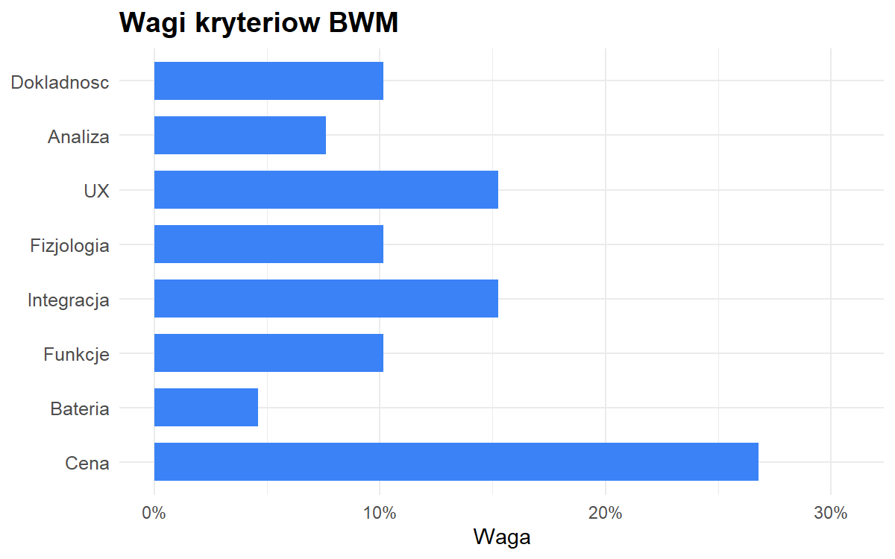
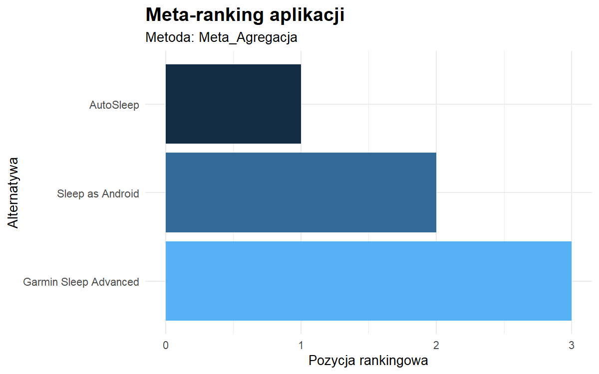

# DreamySleepR

<!-- badges: start -->

<!-- badges: end -->

**DreamySleepR** to pakiet w jezyku R sluzy do oceny i rankingu
aplikacji do monitorowania snu dla studentow z wykorzystaniem metod
wielokryterialnych w srodowisku rozmytym (Fuzzy MCDA).

Pakiet stanowi narzedzie badawcze opracowane na potrzeby pracy
licencjackiej:

**„DreamySleepR: Pakiet R do oceny i rankingu aplikacji do monitorowania
snu studentow z wykorzystaniem metod Fuzzy TOPSIS, Fuzzy VIKOR i Fuzzy
MULTIMOORA.”**

Umozliwia on pelna sciezke analityczna: od danych eksperckich, przez ich
agregacje w postaci rozmytej, az po wyznaczenie rankingow metodami
**Fuzzy TOPSIS**, **Fuzzy VIKOR**, **Fuzzy MULTIMOORA** oraz ich
**meta-rankingu (konsensusu)**.

------------------------------------------------------------------------

## Funkcje pakietu

- przygotowanie i agregacje **rozmytych ocen ekspertow** (TFN)
- obsluge danych dla 3 alternatyw, 8 kryteriow, 15 ekspertow
- wyznaczanie wag kryteriow metoda **BWM** (Best-Worst Method)
- **rozmyty_meta_ranking()** - agregacje wynikow TOPSIS, VIKOR,
  MULTIMOORA
- **tabela_apa()** - generowanie tabel gotowych do raportowania
- **wizualizacje wynikow** rankingow i porownan

------------------------------------------------------------------------

## Instalacja

``` r
install.packages("devtools")
devtools::install_github("anbuszek/DreamySleepR")
```

## Szybki start

``` r
library(DreamySleepR)
data("mcda_dane_surowe")

head(mcda_dane_surowe, 9)
#>   EkspertID Aplikacja dokladnosc_faz_snu analiza_statystyk ux_latwosc
#> 1         1 AutoSleep                  6                 7          8
#> 2         2 AutoSleep                  1                 7          6
#> 3         3 AutoSleep                  9                 9          7
#> 4         4 AutoSleep                  9                 9          9
#> 5         5 AutoSleep                  1                 8          9
#> 6         6 AutoSleep                  8                 7          9
#> 7         7 AutoSleep                  9                 4          7
#> 8         8 AutoSleep                  7                 7          9
#> 9         9 AutoSleep                  9                 6          5
#>   dane_fizjologiczne integracja_urzadzenia funkcje_dodatkowe zuzycie_baterii
#> 1                  6                     6                 6               9
#> 2                  7                     8                 5               9
#> 3                  9                     6                 8               5
#> 4                  2                     3                 8               5
#> 5                  9                     8                 8               2
#> 6                  4                     8                 9               1
#> 7                  8                     5                 8               3
#> 8                  9                     7                 9               2
#> 9                  3                     6                 9               1
#>   cena_subskrypcja
#> 1                2
#> 2                9
#> 3                9
#> 4                1
#> 5                1
#> 6                3
#> 7                9
#> 8                4
#> 9                3
```

Przygotowanie rozmytej macierzy decyzyjnej:

``` r
skladnia <- "
  Dokladnosc =~ dokladnosc_faz_snu;
  Analiza =~ analiza_statystyk;
  UX =~ ux_latwosc;
  Fizjologia =~ dane_fizjologiczne;
  Integracja =~ integracja_urzadzenia;
  Funkcje =~ funkcje_dodatkowe;
  Bateria =~ zuzycie_baterii;
  Cena =~ cena_subskrypcja
"

dane_rozmyte <- przygotuj_dane_mcda(
  dane = mcda_dane_surowe,
  skladnia = skladnia,
  kolumna_alternatyw = "Aplikacja"
)

dane_rozmyte
#>                              l        m        u        l        m        u
#> AutoSleep             5.666667 6.666667 7.666667 6.000000 7.000000 8.000000
#> Sleep as Android      6.400000 7.400000 8.400000 4.600000 5.600000 6.600000
#> Garmin Sleep Advanced 5.200000 6.200000 7.200000 2.933333 3.933333 4.933333
#>                              l        m        u        l        m        u
#> AutoSleep             7.000000 8.000000 9.000000 4.419048 5.419048 6.419048
#> Sleep as Android      4.000000 5.000000 6.000000 4.038095 5.038095 6.038095
#> Garmin Sleep Advanced 5.133333 6.133333 7.133333 3.733333 4.733333 5.733333
#>                              l        m        u        l        m        u
#> AutoSleep             5.800000 6.800000 7.800000 6.266667 7.266667 8.266667
#> Sleep as Android      3.066667 4.066667 5.066667 4.466667 5.466667 6.466667
#> Garmin Sleep Advanced 6.466667 7.466667 8.466667 3.400000 4.400000 5.400000
#>                              l        m        u        l        m        u
#> AutoSleep             2.533333 3.533333 4.533333 2.733333 3.733333 4.733333
#> Sleep as Android      3.866667 4.866667 5.866667 4.400000 5.400000 6.400000
#> Garmin Sleep Advanced 6.600000 7.600000 8.600000 5.933333 6.933333 7.933333
#> attr(,"nazwy_kryteriow")
#> [1] "Dokladnosc" "Analiza"    "UX"         "Fizjologia" "Integracja"
#> [6] "Funkcje"    "Bateria"    "Cena"
```

Wagi kryteriow metoda BWM:

``` r
kryteria <- c(
  "Dokladnosc", "Analiza", "UX", "Fizjologia",
  "Integracja", "Funkcje", "Bateria", "Cena"
)

najlepsze_do_innych <- c(3, 4, 2, 3, 2, 3, 5, 1)
inne_do_najgorszego <- c(3, 2, 4, 3, 4, 3, 1, 5)

wynik_bwm <- oblicz_wagi_bwm(
  nazwy_kryteriow = kryteria,
  najlepsze_do_innych = najlepsze_do_innych,
  inne_do_najgorszego = inne_do_najgorszego
)

data.frame(
  Kryterium = kryteria,
  Waga = round(wynik_bwm$wagi_kryteriow, 4)
)
#>    Kryterium   Waga
#> 1 Dokladnosc 0.1016
#> 2    Analiza 0.0762
#> 3         UX 0.1524
#> 4 Fizjologia 0.1016
#> 5 Integracja 0.1524
#> 6    Funkcje 0.1016
#> 7    Bateria 0.0462
#> 8       Cena 0.2679
```

## Meta-ranking

Agregacja wynikow trzech metod w ranking konsensusu:

``` r
typy_kryteriow <- c("max", "max", "max", "max", "max", "max", "min", "min")

macierz <- as.matrix(dane_rozmyte)

wynik_meta <- rozmyty_meta_ranking(
  macierz_decyzyjna = macierz,
  typy_kryteriow = typy_kryteriow,
  bwm_kryteria = kryteria,
  bwm_najlepsze = najlepsze_do_innych,
  bwm_najgorsze = inne_do_najgorszego
)
#> Obliczanie wag metodą BWM...
#> Obliczanie wag metodą BWM...

wynik_meta$porownanie
#>             Alternatywa R_VIKOR R_TOPSIS R_MULTIMOORA Meta_Suma Meta_Dominacja
#> 1             AutoSleep       1        1            1         1              1
#> 2      Sleep as Android       2        2            2         2              2
#> 3 Garmin Sleep Advanced       3        3            3         3              3
#>   Meta_Agregacja
#> 1              1
#> 2              2
#> 3              3
```

## Wizualizacja

Wagi BWM:

``` r
DreamySleepR:::.wykres_bwm(wynik_bwm)
```



Meta-ranking:

``` r
plot(wynik_meta)
```



## Tabele APA

Pakiet generuje tabele zgodne ze stylem APA:

``` r
tabela_apa(wynik_meta)
```


## Dokumentacja

Pelna instrukcja krok po kroku:

``` r
vignette("poradnik_mcda", package = "DreamySleepR")
```

## Autor

Anna Buszek

## Licencja

GPL-3
